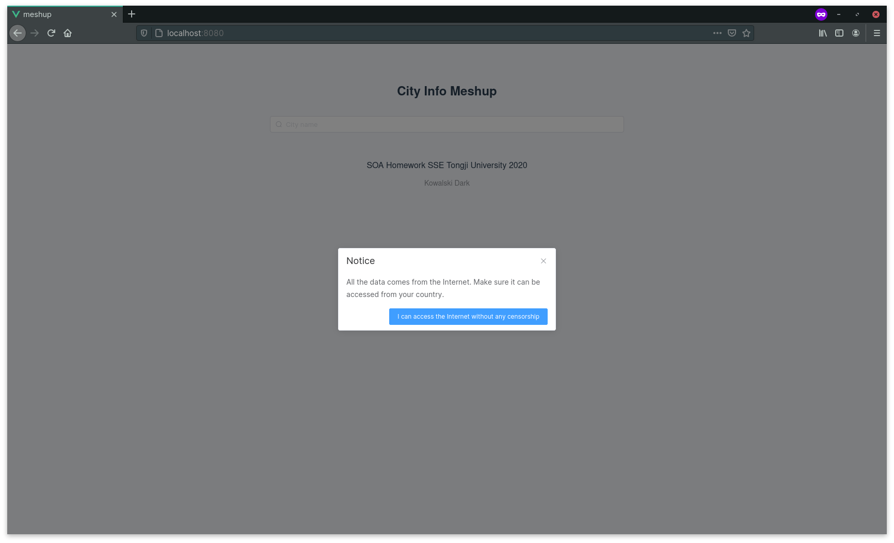
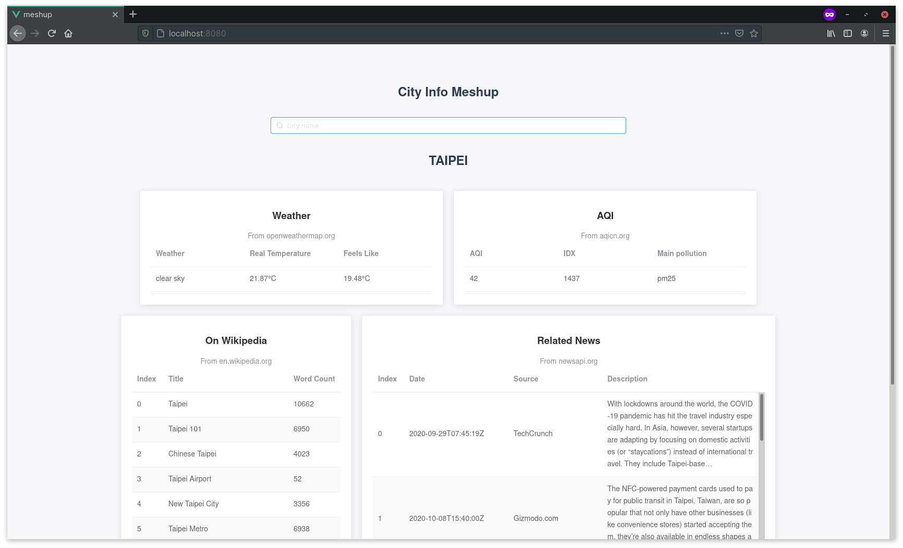
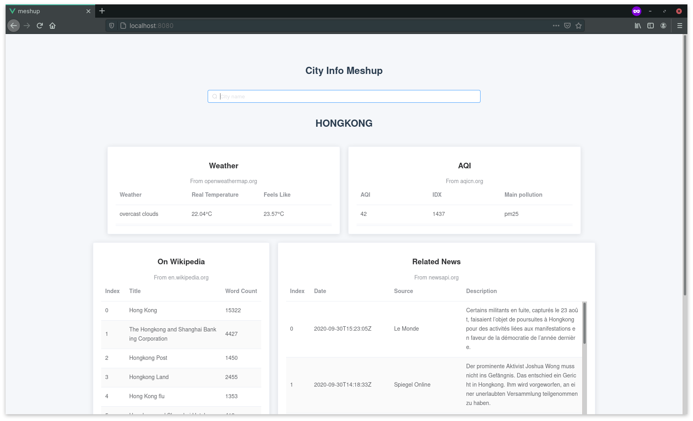
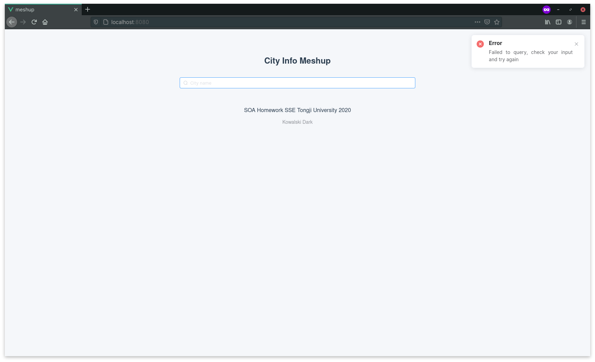

# SOA Homework

All APIs can return a result in either JSON or XML format, read [API Doc](./doc/README.md) and checkout samples for more info.
## Notice

Read `Dockerfile.api` and `Dockerfile.web`, you can remove or change gem and npm mirrors

Read `docker-compose.yml` and setup environment variables!

**All data comes from the the Internet and make sure it can be accessed from your country!**

**You must setup API Keys for**
- openweathermap.org
- newsapi.org
- aqicn.org

## Usage

```
docker-compose up
```

then open `http://localhost:8080`

## Screenshot

Notice



Meshup 





Failure


